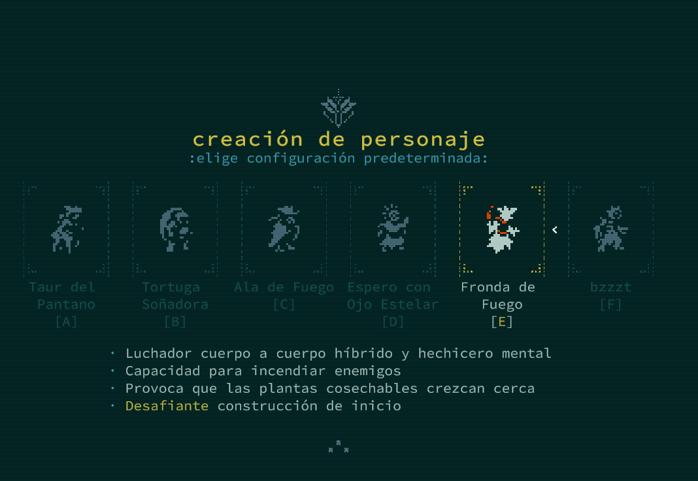
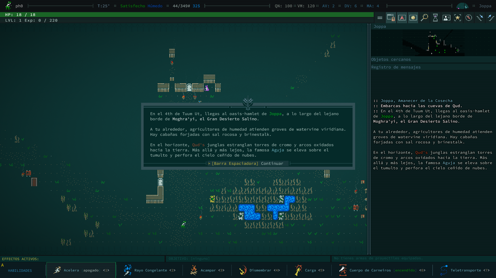

# Caves of Qud — Translation Pipeline


Automated XML translation pipeline for [Caves of Qud](https://www.cavesofqud.com/) using a local LLM via [llama.cpp](https://github.com/ggerganov/llama.cpp). Translates every `▶`-marked string in `ExampleLanguage/*.example.xml` and writes the results as a ready-to-install language mod.

Currently focused on **Spanish**, but the pipeline is language-agnostic — a `.env` file lets you point it at any target language and it will generate the corresponding mod folder and XML files automatically.

Tested with **Qwen3-14B-UD-Q4_K_XL** on an NVIDIA RTX 5060 Ti 16 GB.

> **Requires the `lang-experimental` Steam branch** — right-click the game in Steam → Properties → Betas → select `lang-experimental`.

---

## Requirements

- Docker + Docker Compose (recommended)
- Or: Python 3.10+ and a running [llama.cpp](https://github.com/ggml-org/llama.cpp) server

---

## Setup

### 1. Configure environment

Copy `.env.example` to `.env` and fill in your values:

```bash
cp .env.example .env
```

Key variables:

| Variable | Description |
| -------- | ----------- |
| `STREAMING_ASSETS_DIR` | Path to the game's `StreamingAssets/` folder |
| `TARGET_LANGUAGE` | Language name used in prompts (e.g. `Spanish`) |
| `LANG_CODE` | File suffix and `languages.xml` code (e.g. `es`) |
| `MOD_NAME` | Output folder and mod name (e.g. `SpanishLanguage`) |
| `MOD_DISPLAY_NAME` | Language name shown in the in-game picker |
| `LLM_ENDPOINT` | llama.cpp or compatible OpenAI endpoint |
| `BATCH_SIZE` | Strings per LLM call |
| `WORKERS` | Parallel threads — match llama.cpp `-np` |

### 2. Start services

```bash
docker compose up
```

This starts:
- `translation-editor` — Django web editor at <http://localhost:8000>
- `llama-server` — llama.cpp inference server at <http://localhost:9090>

Default credentials: **admin / admin** — change after first login.

### 3. Project layout

```text
CoQ_Translate/
├── .env                                ← your local config (not committed)
├── .env.example                        ← template
├── compose.yml
├── prompts/
│   ├── tone_rules.txt                  ← literary style guide
│   ├── sys_single.txt                  ← single-string system prompt
│   └── sys_batch.txt                   ← batch system prompt
├── editor/
│   ├── db.sqlite3                      ← translation database
│   └── translations/
│       └── pipeline.py                 ← shared XML/LLM helpers
└── SpanishLanguage/                    ← generated mod (auto-created)
    ├── manifest.json
    └── languages/
        ├── languages.xml
        └── lang-es/
            ├── Strings.es.xml
            └── ...
```

---

## Usage

All commands are run from the `editor/` directory (or via `docker compose exec translation-editor`):

```bash
cd editor

# 1. Scan all .example.xml and create pending entries in the DB
python manage.py scan_xml

# 2. Fill in translations from the JSON memory cache (fast, no LLM)
python manage.py import_memory

# 3. LLM-translate whatever is still pending
python manage.py translate_pending

# 4. Export final .es.xml files from the DB
python manage.py export_xml
```

Each step is safe to interrupt and resume. You can also target a single language:

```bash
python manage.py scan_xml --language Spanish
python manage.py import_memory --language Spanish
python manage.py translate_pending --language Spanish --batch-size 10
python manage.py export_xml --language Spanish
```

Pass `--help` to any command for full options.

---

## Prompt tuning

Edit `prompts/tone_rules.txt` to adjust the literary style guide, or `prompts/sys_single.txt` / `prompts/sys_batch.txt` to rewrite the system prompts. `{lang}` is substituted at runtime with `TARGET_LANGUAGE`. Restart the editor container after changes.

---

## Web Editor

The Django editor at <http://localhost:8000> lets you review, search, and edit translations without touching any files.

### Features

- Browse all translated strings filtered by file, language, or status
- Inline status workflow: `auto` (LLM) → `reviewed` (human-approved) → `failed`
- Edit translations in the browser; reviewed entries are **never overwritten** by the pipeline
- Full-text search on source and translation fields

---

## How it works

1. **Scan** (`scan_xml`) — walks each `ExampleLanguage/*.example.xml` and creates a pending DB entry for every `▶`-prefixed string
2. **Import** (`import_memory`) — fills entries from any existing JSON translation cache (no LLM calls)
3. **Translate** (`translate_pending`) — sends pending strings to the LLM in batches; falls back to individual calls on malformed responses
4. **Export** (`export_xml`) — rebuilds the `.es.xml` files from the DB, substituting reviewed and auto translations

**Variable protection**: game variables and XML entities are replaced with `[[P0]]`, `[[P1]]`, … before the LLM call and restored afterwards.

> **Backup**: `editor/db.sqlite3` contains all your translations. Back it up before bulk operations.

---

## Output files

| File | Description |
| ---- | ----------- |
| `SpanishLanguage/languages/lang-es/*.es.xml` | Translated XML files |
| `SpanishLanguage/languages/languages.xml` | Language declaration read by the game |
| `SpanishLanguage/manifest.json` | Mod metadata |

---

## Installation

Copy the generated mod folder into the game's Mods directory:

```text
C:\Program Files (x86)\Steam\steamapps\common\Caves of Qud\CoQ_Data\StreamingAssets\Mods\SpanishLanguage\
```

Then launch the game (on the `lang-experimental` branch), select the language in the language selector, the game will restart and enjoy!

---

## Screenshots





---

## License

This project is a fan tool and is not affiliated with Freehold Games.

Code released under the [MIT License](LICENSE).

